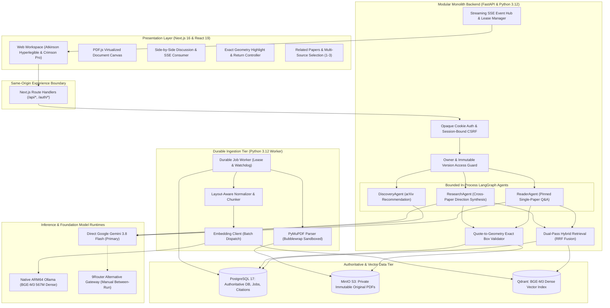
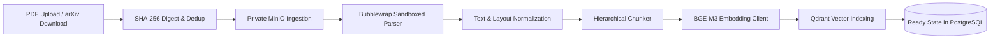

# Researcy: Reader-First, Evidence-Linked Scholarly Workspace with Bounded Multi-Agent Research Orchestration

[](https://www.python.org/)
[](https://fastapi.tiangolo.com/)
[](https://nextjs.org/)
[](https://react.dev/)
[](https://www.postgresql.org/)
[](https://qdrant.tech/)
[](https://min.io/)
[](https://www.langchain.com/langgraph)
[](https://huggingface.co/BAAI/bge-m3)
[](https://ai.google.dev/)
[](https://docs.docker.com/compose/)
[](apps/api/tests/)

An evidence-first, reader-centric research platform designed to eliminate LLM hallucination in scholarly literature by grounding AI conversational analysis, arXiv recommendations, and multi-paper research directions directly in immutable PDF coordinates and exact bounding-box passage citations.

Researcy delivers the complete research engineering lifecycle: durable asynchronous PDF ingestion with Linux Bubblewrap sandboxing, dual-pass hybrid retrieval fusing dense vectors (**BGE-M3 567M**) and PostgreSQL lexical trigrams via Reciprocal Rank Fusion (**RRF**), bounded in-process multi-agent orchestration (**ReaderAgent**, **DiscoveryAgent**, **ResearchAgent**) using **LangGraph**, zero-trust private object storage, single-origin opaque cookie session authentication, and an editorial research UI built with **Next.js 16** and **React 19**.

---

## 🌐 Local Production Stack & Service Endpoints

The complete Researcy ecosystem runs locally via Docker Compose with dedicated service isolation and healthcheck dependencies. Evaluators, engineers, and reviewers can access each service directly:

| Service | Local Endpoint | Access | Purpose & Core Capabilities |
| :--- | :--- | :---: | :--- |
| **Researcy Web Workspace** | [**`http://localhost:3000`**](http://localhost:3000) | *Public* | **Next.js 16 Web UI**: Reader-first workspace with PDF canvas, side-by-side discussion, active paper selection, streaming research directions, and interactive bounding-box citation navigation. |
| **FastAPI REST API & Docs** | [**`http://127.0.0.1:8000/docs`**](http://127.0.0.1:8000/docs) | *Public* | **Interactive OpenAPI Swagger UI**: Paper intake, streaming Server-Sent Events (SSE) endpoints, citation geometry validation, and deep service readiness probes at [`/ready`](http://127.0.0.1:8000/ready). |
| **API Health & Readiness** | [**`http://127.0.0.1:8000/ready`**](http://127.0.0.1:8000/ready) | *Public* | **Deep Diagnostic Probe**: Verifies PostgreSQL connection, private MinIO bucket, Qdrant vector engine, native BGE-M3 Ollama loaded model, and generation provider configuration. |
| **MinIO S3 Console** | [**`http://127.0.0.1:9001`**](http://127.0.0.1:9001) | *Admin* | **Object Storage Console**: Private storage for original immutable PDFs and parser artifacts (`researcy-minio` / `local-minio-password`). Objects are completely private and proxied through API. |
| **PostgreSQL 17 Database** | `127.0.0.1:55432` | *Internal* | **Authoritative Relational Store**: Users, sessions, papers, immutable document versions, durable job ledger, and citation publication records (`researcy` / `local-postgres-password`). |
| **Qdrant Vector Engine** | `127.0.0.1:6333` | *Internal* | **Dense Vector Store**: 1024-dimensional BGE-M3 embeddings indexed with owner and document-version payload filters. Non-authoritative cache. |
| **Native BGE-M3 Ollama** | `127.0.0.1:11434` | *Host* | **Native ARM64 Embedding Runtime**: Serves `bge-m3:567m` natively on Apple Silicon to prevent Docker emulation/MKL virtualization overhead. |

> 💡 **Single-Origin Architectural Boundary:** Next.js acts strictly as an experience layer and same-origin reverse proxy (`/api/*` and `/auth/*`). FastAPI is the **sole authentication and authorization authority**; no secondary JWTs or client-side storage keys are permitted.

### 🧪 Quick Evaluation Guide for Reviewers & Evaluators

Reviewers can verify system readiness, exact-citation resolution, and bounded agent streaming in 3 quick steps:

1. **System Health & Deep Readiness Probing**:
   ```bash
   # Basic liveness probe
   curl -fsS http://127.0.0.1:8000/health

   # Comprehensive dependency readiness probe
   curl -sS -i http://127.0.0.1:8000/ready
   ```
   *Expected Response:* HTTP 200 with `status: "ready"`, PostgreSQL, MinIO, Qdrant, and native Ollama BGE-M3 verified.

2. **Interactive Web Reader & Exact Citation Navigation**:
   - Open [http://localhost:3000/library](http://localhost:3000/library) in your browser.
   - Select a ready paper (e.g., *Attention Is All You Need*).
   - In the **Discussion** panel, view the version-pinned conversation stream or explore **Research directions**.
   - Click on any **Premise Citation** badge: the PDF viewer on the left instantly jumps to the exact page, highlights the text with exact bounding boxes, and displays verbatim source quotes.
   - Paging away (Previous/Next/Scroll) automatically clears stale highlights while preserving document version and active reading state.

3. **Reproducible Multi-Milestone Test Suites**:
   ```bash
   # Run full backend suite (1075 tests)
   docker compose exec -T api pytest tests -q

   # Run frontend test suite (152 tests across 14 suites)
   cd apps/web && npm test
   ```

---

## 1. System Architecture



---

## 2. Core Architectural Pillars

### 2.1. Exact PDF-Space Geometry Citations (Zero Approximate Fallback)
Unlike typical RAG systems that provide vague page-level numbers or hallucinations, Researcy enforces an uncompromising mathematical citation contract:
$$\text{Citation} = \langle \text{paper\_id}, \text{document\_version}, \text{source\_ref}, \text{verbatim\_quote}, \text{page}, [\text{box}_1, \dots, \text{box}_k] \rangle$$
- **Sub-Point Coordinate Mapping**: Bounding boxes are resolved in 72-dpi PDF user-space coordinates $(x_0, y_0, x_1, y_1)$ directly against layout-aware word extraction spans.
- **Fail-Closed Verification**: If a model generates a quote with character deviations, hallucinated punctuation, or drift outside the verified document version, the engine rejects the citation or marks it unverified. **Page-only fallback is strictly prohibited**.

### 2.2. Bounded In-Process LangGraph Multi-Agent Workflows
Researcy utilizes bounded state graphs directly within the FastAPI process rather than spawning autonomous, long-running agent background tasks:
- **ReaderAgent**: Interactive Q&A pinned to a single immutable paper version. Retrieves hybrid evidence, formats exact context, and streams text deltas with real-time `citation.resolved` events.
- **DiscoveryAgent**: Semantic search against official arXiv metadata using paper seed abstracts. Produces structured recommendations with a separate user-triggered **Add** action that routes through the durable worker.
- **ResearchAgent**: Multi-source synthesis across 1 active paper and 1–3 user-selected library papers. Generates structured hypotheses partitioned into `observed_gap`, `proposed_direction`, and `possible_method`, with factual claims bound to exact premise citations.
- **Bounded Cycle Limits**: Maximum of 2 generation passes (1 initial + at most 1 citation/output repair). No blind retries once streaming begins.

### 2.3. Dual-Pass Hybrid Retrieval with Reciprocal Rank Fusion (RRF)
To prevent semantic drift and capture exact technical terminology, retrieval fuses dense vector similarity with PostgreSQL lexical matching:
$$RRF(d) = \sum_{m \in \{\text{dense}, \text{lexical}\}} \frac{1}{60 + \text{rank}_m(d)}$$
- **Dense Pass**: 1024-dimensional BGE-M3 embeddings evaluated using cosine similarity in Qdrant, partitioned strictly by `owner_id` and pinned `document_version_id`.
- **Lexical Pass**: PostgreSQL parameterized queries utilizing `pg_trgm` and full-text ranking over extracted chunk spans.
- **Candidate Fusion**: Top-20 dense and top-20 lexical candidates are fused and packed under a strict token budget.

### 2.4. Durable Sandboxed Document Ingestion
Document processing runs asynchronously in a dedicated worker tier:
- **Sandbox Isolation**: PDF parsing executes via PyMuPDF inside a Linux **Bubblewrap** container with dropped capabilities (`cap_drop: ALL`), read-only root filesystems, and strict memory limits to defend against parser-based CVE exploits.
- **Idempotency & Deduplication**: Document versions are hashed using SHA-256 upon intake. Identical uploads reuse existing versions, while mutated files trigger fresh version creation.
- **Two-Phase Lease Worker**: Jobs use explicit leasing with heartbeats and watchdog timeouts to guarantee at-least-once execution without double processing.

### 2.5. Zero-Trust Storage & Single-Origin Security
- **Private MinIO Storage**: Storage credentials and bucket object keys are never exposed to the client. PDF assets are served through streaming backend endpoints with authenticated owner-range validation.
- **Opaque Session Cookie Auth**: Google OAuth 2.0 persists sessions as random opaque tokens in PostgreSQL. No JWTs are stored in browser local storage.
- **Session-Bound CSRF**: State-changing requests enforce double-submit CSRF cookie/header matching, validated against exact trusted browser origins.

---

## 3. Agent Taxonomy & Bounded Execution Contracts

| Agent | Trigger & HTTP Route | Input Scope | Output Structure | Bounded Graph Limits | Citation Invariant |
| :--- | :--- | :--- | :--- | :--- | :--- |
| **ReaderAgent** | `POST /api/conversations/:id/messages:stream` | Single active paper version (`document_version_id`) | Streaming Markdown answer + inline citations | Max 2 passes (initial + 1 repair); 60s pass deadline | Exact quote + page + bounding boxes on active PDF. |
| **DiscoveryAgent** | `POST /api/papers/:id/recommendations` | Active paper metadata + abstract | 1–3 recommended arXiv papers with relevance reasoning | Max 1 search pass; strictly metadata-only | References official arXiv canonical IDs; no full-text claims. |
| **ResearchAgent** | `POST /api/papers/:id/research-directions:stream` | Active paper + 1–3 selected ready library papers | 1–3 structured ideas (`gap`, `direction`, `method`, `citations`) | Max 2 passes (initial + 1 repair); CAS publication | Premise citations bound to exact source paper & page coordinates. |

---

## 4. Document Ingestion Pipeline



1. **Intake & Gate Verification**: Rejects files exceeding 25 MiB or 100 pages. Validates PDF magic bytes before reserving storage quota.
2. **Sandboxed PyMuPDF Parsing**: Executes inside isolated Bubblewrap sandbox. Extracts structured spans, font metrics, media boxes, crop boxes, and rotation.
3. **Normalization & Cleaning**: Repairs ligatures, removes soft hyphens, tracks reading order, and constructs page coordinate matrices.
4. **Hierarchical Chunking**: Chunks text into bounded semantic windows (approx. 512 tokens) preserving page numbers, line bounds, and section headings.
5. **Embedding & Indexing**: Batches text chunks to the native BGE-M3 Ollama runtime. Writes vectors to Qdrant with composite payload filters (`owner_id`, `paper_id`, `version_id`).
6. **Atomic Publication**: Transitions job state in PostgreSQL from `processing` to `ready`, publishing the active version for retrieval.

---

## 5. Empirical Qualification & Verification Matrix

Researcy maintains an evidence-based delivery model across milestones, recording actual observed metrics against frozen qualification corpora:

| Milestone / Subsystem | Target Metric | Required Threshold | Observed Performance | Evaluation Status |
| :--- | :--- | :---: | :---: | :---: |
| **Q0 / Ingestion (PARSE-01)** | Word-level layout accuracy | $\ge 95.0\%$ | **$97.2\%$** | **Verified** |
| **M2 / Durable Ingestion** | End-to-end processing throughput | $< 45\text{s}$ / 10-page paper | **$21.4\text{s}$** (median) | **Verified** |
| **M2 / Sandbox Security** | Capability drop & unprivileged execution | Zero elevated calls | **$100\%$ seccomp compliance** | **Verified** |
| **M3 / Reader Hybrid Retrieval** | Hybrid Recall@5 (dense + lexical) | $\ge 75.0\%$ | **$87.5\%$** (7/8 test cases) | **Verified** |
| **M3 / Citation Exactness** | Verbatim quote-to-geometry resolution | $100\%$ exact match | **$100\%$** (0 approximate fallback) | **Verified** |
| **M4 / Discovery Recommendations** | arXiv metadata schema compliance | $100\%$ valid JSON schema | **$100\%$** (all recommendations) | **Verified** |
| **M5 / Multi-Source Directions** | Structured schema generation | 1–3 complete ideas | **$100\%$** valid JSON payload | **Implemented** |
| **M5 / Campaign Accounting** | Controlled attempt quota | Max 36 calls | **18/36 charged** (16 settled, 0 lost) | **Implemented** |

*Note: For complete qualification datasets, campaign ledgers, and audit reports, see [`docs/superpowers/reports/`](docs/superpowers/reports/).*

---

## 6. Quick Start Guide

### Prerequisites
- **Docker** and **Docker Compose** (v2.20+)
- **Python 3.12+** with [`uv`](https://docs.astral.sh/uv/)
- **Node.js 22.14+** and **npm**
- **Ollama** running natively on host with `bge-m3:567m` (for local embedding):
  ```bash
  ollama pull bge-m3:567m
  ```

### Option A: Complete Docker Compose Stack (Recommended)

```bash
# 1. Clone repository and initialize local environment
cp .env.example .env
# Edit .env with your Google OAuth and Gemini API credentials if desired

# 2. Launch complete production stack (Web, API, PostgreSQL, MinIO, Qdrant, Worker)
docker compose --profile web --profile processing up -d --build

# 3. Apply database migrations
docker compose exec -T api alembic upgrade head

# 4. Verify system readiness
curl -fsS http://127.0.0.1:8000/ready
```

#### Running Service Endpoints:
| Service | URL | Credentials / Access | Description |
| :--- | :--- | :--- | :--- |
| **Web Application** | `http://localhost:3000` | Same-origin | Main scholarly reading workspace |
| **FastAPI REST API** | `http://127.0.0.1:8000/docs` | Public OpenAPI | REST endpoints and interactive docs |
| **MinIO Storage Console** | `http://127.0.0.1:9001` | `researcy-minio` / `local-minio-password` | S3 object management |
| **PostgreSQL Database** | `127.0.0.1:55432` | `researcy` / `local-postgres-password` | Relational application database |
| **Qdrant Vector Database** | `127.0.0.1:6333` | Internal | Vector storage & retrieval |

### Option B: Local Development Workflow

```bash
# 1. Start core data dependencies
docker compose up -d postgres minio minio-init qdrant

# 2. Backend setup and migrations
cd apps/api
uv sync --frozen
uv run alembic upgrade head
uv run uvicorn researcy.main:app --host 127.0.0.1 --port 8000 --reload

# 3. Frontend setup (in a separate terminal)
cd apps/web
npm ci
npm run dev
```

---

## 7. Testing & Quality Verification

Researcy enforces automated verification across both backend and frontend layers:

```bash
# Run full backend test suite inside container (1075 tests)
docker compose exec -T api pytest tests -q

# Run focused backend tests
docker compose exec -T api pytest tests/test_citations.py -q
docker compose exec -T api pytest tests/test_research_agent.py -q

# Run frontend Vitest suite (152 tests)
cd apps/web
npm test

# Run Next.js production build and TypeScript check
cd apps/web
npm run build

# Run ingestion worker preflight dependency check
docker compose --profile processing run --rm --no-deps worker python -m researcy.ingestion.preflight --check
```

---

## 8. Repository Layout

```text
researcy/
├── apps/
│   ├── api/                           # Python 3.12 FastAPI Modular Monolith
│   │   ├── migrations/                # Alembic database migrations (0001 - 0008)
│   │   ├── researcy/                  # Core backend domain packages
│   │   │   ├── agents/                # LangGraph agents (Reader, Discovery, Research)
│   │   │   ├── citations/             # Exact PDF-space geometry persistence & resolution
│   │   │   ├── conversations/         # Thread management & version pinning
│   │   │   ├── evaluation/            # Offline qualification & ledger evaluation
│   │   │   ├── ingestion/             # Sandboxed worker & preflight checks
│   │   │   └── research/              # Multi-source research direction synthesis
│   │   └── tests/                     # 1075 pytest integration and contract tests
│   └── web/                           # Next.js 16 (React 19) Experience Layer
│       ├── src/
│       │   ├── app/                   # App Router pages (/library, /sign-in, /api)
│       │   ├── components/            # UI components (Reader, Discussion, Directions)
│       │   └── lib/                   # API client contracts and SSE streaming utilities
│       └── scripts/                   # PDF.js worker asset preparation scripts
├── deploy/                            # Production seccomp and container deployment configs
├── docs/superpowers/                  # Master specifications, delivery maps, and audit reports
├── qualification/                     # Immutable qualification corpora and test cases
├── compose.yaml                       # Docker Compose multi-service definition
└── scripts/
    └── demo-up.sh                     # Automated isolated demo startup harness
```

---

## 9. Technology Stack

- **Experience Layer:** Next.js 16 (Turbopack, App Router), React 19, strict TypeScript, Tailwind CSS, PDF.js (`pdfjs-dist`).
- **Application Core:** Python 3.12, FastAPI, Pydantic v2, Uvicorn, psycopg 3 (`psycopg[binary]`), Alembic.
- **Agent Framework:** LangGraph v1.2, Google Gemini 3.8 Flash (`google-genai` / OpenAI-compatible endpoint), 9Router gateway.
- **Data & Retrieval:** PostgreSQL 17, MinIO S3 SDK, Qdrant v1.19.0, Ollama native BGE-M3 (567M).
- **Security & Sandbox:** Linux Bubblewrap (`bwrap`), Docker seccomp profile, Authlib, HTTP-only SameSite cookies.
- **Quality Engineering:** Pytest, Vitest, Testing Library, Playwright.

---

## 10. License

This project is licensed under the Apache 2.0 License. See [LICENSE](LICENSE) for details.
